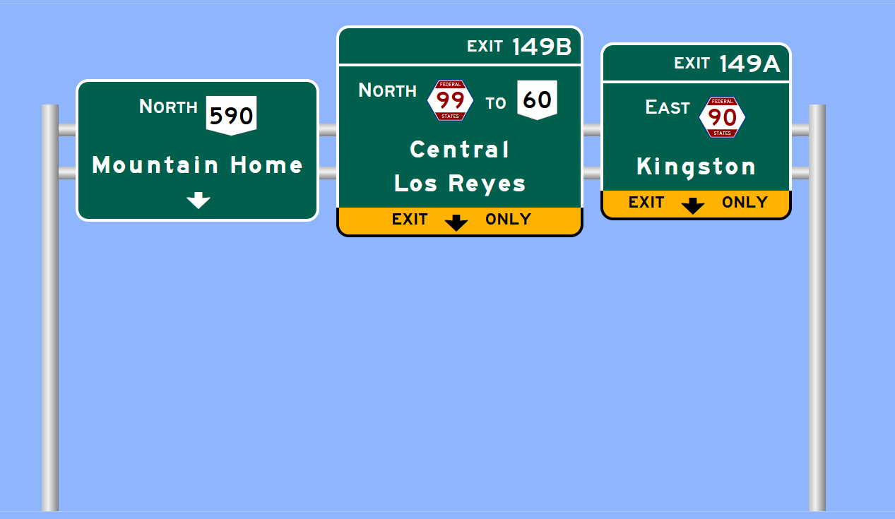

# Sign Maker

A JavaScript-based app for creating highway guide signs. Based off of [Kurumi's Sign Maker](http://www.kurumi.com/roads/signmaker), and forked from [dki-os](https://github.com/dki-os/SignMaker). Allows for the creation of highway guide signs in the style defined by the United States FHWA in their [MUTCD](https://mutcd.fhwa.dot.gov/kno_2009r1r2.htm). Modifications have been made for [OpenGeoFiction](https://opengeofiction.net/#map=6/-36.198/149.063&layers=B), specifically the [FSA Project](https://wiki.opengeofiction.net/index.php/Collab:Federal_States/Transportation).

Current OGF shields supported:
- FSA Routes
- Apawiland Routes
- Tempache Routes

OGF Shields in progress:
- Mennowa

Generic shields:
- Rectangle (with and without border)
- Circle/ellipse (different appearance for 3 digit routes)
- Diamond
- Triangle
- Keystone (PA)
- Shield (US)
- New York
- Oregon
- Virginia
- Wisconsin
- County

## Acknowledgements

Typefaces sourced from the [Roadgeek 2005 Font Family by Michael Adams](https://n1en.org/roadgeek-fonts/).
Route shields are sourced from [Wikipedia](https://en.wikipedia.org/wiki/Numbered_highways_in_the_United_States) and [the OGF wiki](https://wiki.opengeofiction.net/index.php/Category:Highway_shields).

## License

[GNU General Public License v3.0](https://www.gnu.org/licenses/gpl-3.0.txt)
